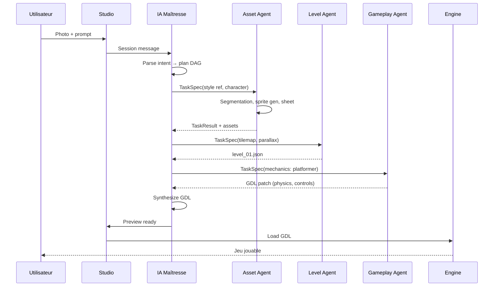

# Architecture système Ellipse

## Vue d'ensemble

Ellipse est un **système distribué** : services indépendants, bus async, agents workers scalables. Cognition via **Ellipse Cortex** ; coordination via **Orchestrator**. Le moteur consomme le **GDL**.

> **ORDRE-006 :** pas de monolithe runtime. Voir [INFRASTRUCTURE.md](./INFRASTRUCTURE.md).

```
┌─────────────────────────────────────────────────────────────────────────┐
│                         ELLIPSE STUDIO (Frontend)                        │
│  Prompt · Upload photos · Timeline agents · Preview · Éditeur visuel    │
└─────────────────────────────────┬───────────────────────────────────────┘
                                  │ WebSocket / REST
┌─────────────────────────────────▼───────────────────────────────────────┐
│                      ORCHESTRATOR (IA Maîtresse)                         │
│  Intent Parser · Task Planner · Agent Router · Conflict Resolver        │
│  Memory (session + projet) · User Feedback Loop                          │
└───┬─────────┬─────────┬─────────┬─────────┬─────────┬─────────┬─────────┘
    │         │         │         │         │         │         │
    ▼         ▼         ▼         ▼         ▼         ▼         ▼
 ┌──────┐ ┌──────┐ ┌──────┐ ┌──────┐ ┌──────┐ ┌──────┐ ┌──────┐
 │Asset │ │Anim. │ │Level │ │Game- │ │Audio │ │  UI  │ │  QA  │
 │Agent │ │Agent │ │Agent │ │play  │ │Agent │ │Agent │ │Agent │
 └──┬───┘ └──┬───┘ └──┬───┘ └──┬───┘ └──┬───┘ └──┬───┘ └──┬───┘
    │        │        │        │        │        │        │
    └────────┴────────┴────────┴────────┴────────┴────────┘
                                  │
                    ┌─────────────▼─────────────┐
                    │   Asset Store (projet)    │
                    │   GDL Repository          │
                    └─────────────┬─────────────┘
                                  │
                    ┌─────────────▼─────────────┐
                    │   ELLIPSE ENGINE (Runtime)  │
                    │   2D (Canvas/WebGL) · 3D    │
                    └─────────────────────────────┘
```

---

## Couches

### 1. Couche présentation — Ellipse Studio
- **Stack :** React + TypeScript + Tailwind + Three.js / PixiJS (preview)
- **Rôles :** chat, upload médias, timeline des agents, preview embarqué, éditeur de propriétés
- **État :** synchronisé avec le backend via CRDT ou WebSocket (collaboration future)

### 2. Couche cognition — Ellipse Cortex (`@ellipse/cortex`)
- **Rôle :** seule source d'intelligence du système (ORDRE-001)
- **Composants :**
  - **CortexMaster** — intent, plan DAG, synthèse GDL
  - **Model Registry** — liaison agent ↔ poids Ellipse
  - **Memory** — contexte projet (Phase 2)

### 3. Couche orchestration — Orchestrator
- **Rôle :** API, sessions, bus messages — **ne raisonne pas**, délègue à Cortex

### 4. Couche agents — Sous-IA enregistrées
Chaque agent :
- Est **enregistré** dans `packages/agents/src/registry.ts`
- Reçoit une **TaskSpec** (JSON Schema)
- Charge son **modèle Ellipse** via Cortex Model Registry
- Émet une **TaskResult** + artefacts (fichiers, patches GDL)

Voir [AGENTS.md](./AGENTS.md) pour le détail.

### 5. Couche pipeline — Génération d'assets
- Modèles diffusion (images, textures)
- Reconstruction 3D (photo → mesh) — TripoSR, InstantMesh, etc.
- Rigging & animation procédurale / retargeting
- Normalisation formats (PNG, glTF, WAV, spritesheets)

### 6. Couche runtime — Ellipse Engine
- Interprète le **GDL** (Game Definition Language)
- Boucle de jeu : input → systèmes → render → audio
- Hot-reload quand GDL ou assets changent
- Export build (WebAssembly, Electron, futur mobile)

---

## Game Definition Language (GDL)

Format déclaratif JSON/YAML décrivant un jeu sans code impératif utilisateur.

```yaml
# Extrait conceptuel — voir schemas/gdl/game.schema.json
meta:
  title: "Chat Ninja"
  dimension: "2d"          # 2d | 3d
  resolution: [1920, 1080]

style:
  palette: ["#1a1a2e", "#e94560"]
  reference_assets: ["ref_001.png"]

entities:
  - id: player
    type: character
    assets: { sprite: "player_sheet.png", animations: {...} }
    components:
      - transform: { x: 100, y: 400 }
      - physics: { body: dynamic, gravity: 980 }
      - controller: { scheme: platformer }
      - health: { max: 3 }

scenes:
  - id: level_01
    tilemap: "level_01.json"
    entities: [player, enemy_01]
    triggers:
      - zone: { x: 800, y: 0, w: 50, h: 600 }
        on_enter: { action: load_scene, target: level_02 }

systems:
  - input
  - physics
  - collision
  - animation
  - ui
```

Les agents **patchent** le GDL (JSON Patch RFC 6902) plutôt que de réécrire le fichier entier.

---

## Bus de messages inter-agents

| Canal | Usage |
|-------|-------|
| `task.assign` | Maîtresse → Agent |
| `task.progress` | Agent → Maîtresse (streaming) |
| `task.complete` | Agent → Maîtresse + artefacts |
| `task.fail` | Agent → Maîtresse + raison + recovery hints |
| `asset.register` | Agent → Asset Store |
| `gdl.patch` | Agent → GDL Repository |
| `user.feedback` | Studio → Maîtresse |

Transport : **Redis Streams** ou **NATS** — **obligatoire en prod** (ORDRE-006). EventEmitter in-process **uniquement en dev temporaire**, à migrer.

---

## Flux type : « Crée un platformer avec cette photo »



---

## Sécurité & garde-fous

- **Sandbox** — Code généré (si any) exécuté dans VM isolée (QuickJS / isolated-vm)
- **Modération** — Filtrage contenu uploadé et prompts (NSFW, violence)
- **Quotas** — Limites génération GPU par tier utilisateur
- **Provenance** — Métadonnées sur chaque asset (modèle, seed, source photo)

---

## Scalabilité

| Composant | Stratégie |
|-----------|-----------|
| Orchestrator | Horizontal — stateless, sessions en Redis/Postgres |
| Cortex | Horizontal ou GPU node dédié |
| Agents | **1 worker pool par type** — scale indépendant |
| Pipeline GPU | Node pool GPU — workers stateless |
| Engine preview | Client-side WebGPU |
| Stores | S3 + Postgres cluster |

---

## Décisions d'architecture (ADR)

| ID | Décision | Raison |
|----|----------|--------|
| ADR-001 | GDL déclaratif vs code | Zero-code, patchable, validable |
| ADR-002 | Monorepo pnpm | Schemas partagés — **runtime multi-services** |
| ADR-003 | TypeScript orchestrator + agents | DX, typage strict |
| ADR-010 | Services déployables indépendants | ORDRE-006 |
| ADR-011 | Bus async inter-agents | Découplage, scaling |
| ADR-012 | Gateway dédié | Séparation edge / métier |
| ADR-004 | Rust ou Bevy pour engine 3D (Phase 3) | Perf HD ; 2D en TS/WebGL Phase 1 |
| ADR-005 | JSON Schema contrats agents | Interop, validation, doc auto |
